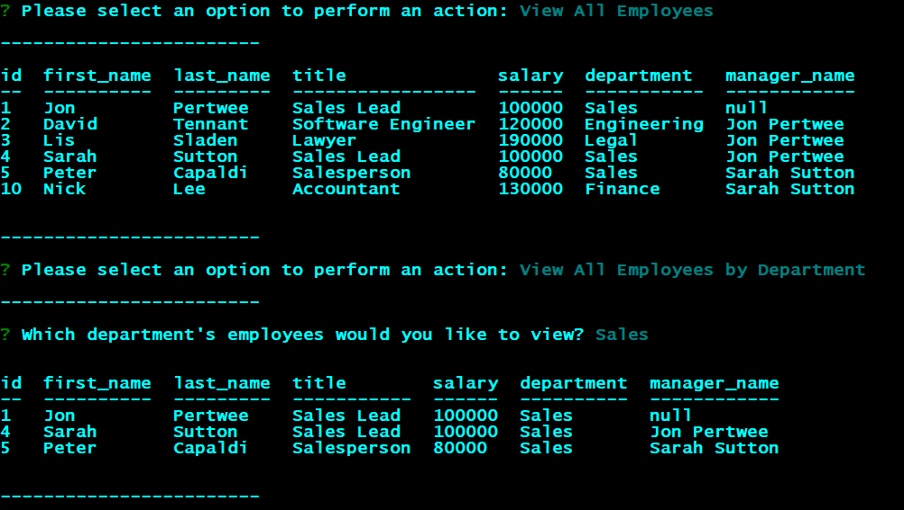

# Employee Management System
Link to instructional video: https://youtu.be/Cgf2qpnbunY

Link to code repository: https://github.com/raven-bootcamp/employee-management

## Table of Contents
- [The Task](#the-task)
- [Instructions for Use](#instructions-for-use)
- [Technologies Used](#technologies-used)
- [User Story](#user-story)
- [Acceptance Criteria](#acceptance-criteria)
- [Screenshot of UI](#screenshot-of-ui)

## The Task
Developers frequently have to create interfaces that allow non-developers to easily view and interact with information stored in databases. These interfaces are called content management systems (CMS). 

The assignment is to build a command-line application from scratch to manage a company's employee database, using Node.js, Inquirer, and MySQL.

Because this application won’t be deployed, we also need to create a walkthrough video that demonstrates its functionality and all of the following acceptance criteria being met.

## Instructions For Use

After checking out the code repository, in a command line, change to the directory where the code was checked out. 

Install the required library files using the following command:

`npm install`

Once everything is installed, run the application with the following command:

`node index.js`

SQL files for database setup and seeding can be found in the `/database` directory.

## Technologies Used
- [Node.js](https://nodejs.org/en/)
- **NPM libraries**:
    + [Inquirer](https://www.npmjs.com/package/inquirer) : to interact with the user in the command line, ask questions, gather results
    + [MySQL](https://www.npmjs.com/package/mysql) : to utilize SQL functionality
    + [Console.table](https://www.npmjs.com/package/console.table) - to output query results to the console in table format
    + [Figlet](https://www.npmjs.com/package/figlet) : for ASCII art 

## User Story
```
AS A business owner
I WANT to be able to view and manage the departments, roles, and employees in my company
SO THAT I can organize and plan my business
```

## Acceptance Criteria
```
GIVEN a command-line application that accepts user input
WHEN I start the application
THEN I am presented with the following options: view all departments, view all roles, view all employees, add a department, add a role, add an employee, and update an employee role
WHEN I choose to view all departments
THEN I am presented with a formatted table showing department names and department ids
WHEN I choose to view all roles
THEN I am presented with the job title, role id, the department that role belongs to, and the salary for that role
WHEN I choose to view all employees
THEN I am presented with a formatted table showing employee data, including employee ids, first names, last names, job titles, departments, salaries, and managers that the employees report to
WHEN I choose to add a department
THEN I am prompted to enter the name of the department and that department is added to the database
WHEN I choose to add a role
THEN I am prompted to enter the name, salary, and department for the role and that role is added to the database
WHEN I choose to add an employee
THEN I am prompted to enter the employee’s first name, last name, role, and manager, and that employee is added to the database
WHEN I choose to update an employee role
THEN I am prompted to select an employee to update and their new role and this information is updated in the database 
```

## Screenshot of UI


